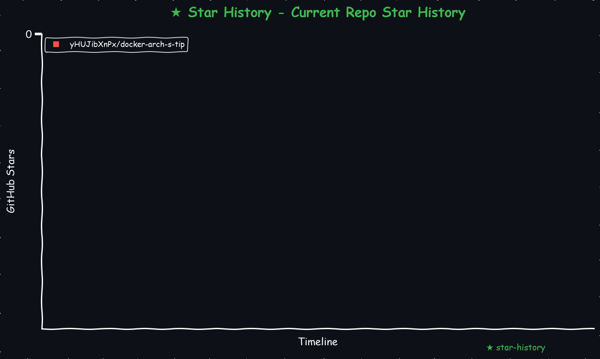

# docker-arch-subs
docker multi-arch 本项目通过 Docker Compose 组合了多架构的镜像，包含节点处理,去重,更新,测试,本地订阅,为一体的 compose 用于自给自足节点供给，就是很不完美，操作可能也没那么好。

## 注意这些项目不是我开发的，我是将这些分散的项目组合！组合！组合！到一起的，请不要再私信我让我开发了，我没有那么多精力学习也没人带我玩，我更不是开发参与者，如果有问题请反馈给参考列表中的相关的开发者，谢谢！

# 说明记录，防止忘记，你可能需要亿点点想象力
目前观察发现，这个结构很稳定，也比较贴近于目前流行的节点处理工具，当然我也折磨了很久，唉，人生就那点时间，真是浪费生命

    
<!-- <a href="https://star-history.com/#yHUJibXnPx/docker-arch-subs&Date">
  <picture>
    <source media="(prefers-color-scheme: dark)" srcset="https://api.star-history.com/svg?repos=yHUJibXnPx/docker-arch-subs&type=Date&theme=dark" />
    <source media="(prefers-color-scheme: light)" srcset="https://api.star-history.com/svg?repos=yHUJibXnPx/docker-arch-subs&type=Date" />
    
  </picture>
</a> -->
<!-- START_STAR_HISTORY_SELF -->

<!-- END_STAR_HISTORY_SELF -->

0. 当前目录结构
    ```plaintext
    .
    ├── .env                                        # docker-compose 环境变量
    ├── README.md                                   # 本目录说明文件
    ├── docker-compose.yml                          # docker-compose yaml 配置文件
    ├── crontab.txt                                 # crontab自动化备份文件
    ├── subconverter                                # subconvert 容器映射目录
    │   ├── cache                                   # subconvert 缓存文件映射目录
    │   └── subconverter目录相关说明.md               # subconvert 目录说明文件
    └── subs-check                                  # subs-check 容器映射目录
        ├── config                                  # subs-check 配置目录
        ├── output                                  # subs-check 输出目录
        └── subs-update-duplicate                   # subs-update-duplicate 处理数据目录
            ├── cfdata                              # cfdata 优选ip
            └── subs-update-duplicate目录相关说明.md  # subs-update-duplicate 目录说明文件
    ```

1. 原理  
- 首先，进入 `subs-check/config` 编辑支持 subs-check 容器的配置文件 [config.yaml](subs-check/config/config.yaml)
- 然后，进入 `subs-check/subs-update-duplicate` 按照 [subs-update-duplicate目录相关说明.md](subs-check/subs-update-duplicate/subs-update-duplicate目录相关说明.md) 处理更新数据节点
- 最后，如果没有报错的话其实没必要执行这一步，进入 subconverter 按照 [subconverter目录相关说明.md](subconverter/subconverter目录相关说明.md)配置下载自己需要的规则缓存文件
- 根据本地cpu架构重命名 .env.arm64 或 .env.amd64 为 .env 检查一下是不是符合自己的配置要求，比如处理器占比，内存占用啊，挂载路径，并发参数，网络区域选择啊之类的
- 执行 `docker-compose up -d` 启动容器
- 访问测试 `subconverter` http://ip:25500/version
- 访问测试 `subweb` http://ip:58080
- 随便找一个节点修改优选ip端口为 `cfnat` 测试 `ip:1234`
- 访问测试 `subs-check` http://ip:8199/8299 如果你配置了 `8199/8299` 和 `apk-key` 的话
- 最后你可以修改 `crontab.txt` 中的 `/home/nanopir3s/Desktop/docker-workspace/docker-arch-subs` 为你自己的路径然后想把法追加到 `crontab` 来实现自动化
  - 比如使用以下命令追加 `crontab`
    ```bash
    crontab -l > current_cron
    cat crontab.txt >> current_cron
    crontab current_cron
    rm current_cron
    ``` 
  - 比如使用以下命令手动编辑 `crontab`
    ```bash
    export EDITOR=$(command -v nano) ; crontab -e
    ```

2. 这个docker-compose.yaml 集成了 subconverter subweb cfnat subs-check  
- 我本想弄一个自给自足结合节点处理、测速、订阅转换为一身的docker容器组合
- 处理数据都有脚本操作节省人工操作，记忆混乱
- 但是吧 subconverter 不同的版本处理不同的节点反馈的结果不一样，就很郁闷
- 关于 subconverter 临时的解决方法就是，针对不同节点修改 .env 切换不同的 subconverter 容器，从而达到输出正常的结果，唉，浪费生命啊

# 注意
* 修改并发要小心，不论是 cfnat subs-check 还是 cfdata 并发数过高，本地运营商就会临时给你断个网，并发数尽可能保守比如100M宽带就设置为2吧，太高没意义

## 许可证
本项目采用 [MIT License](LICENSE) 许可。

## 联系与反馈
遇到问题或有改进建议，请在 [issues](https://github.com/469138946ba5fa/docker-arch-subs/issues) 中提出，或直接联系项目维护者。

# 参考
[gh-proxy](https://gh-proxy.com/)  
[ghproxy](https://ghproxy.net/)  
[cmliu 定制汇聚订阅项目](https://github.com/cmliu/CF-Workers-SUB)  
[cmliu 搜索TLS站点博文](https://cmliussss.com/p/BPBbug/)  
[github beck-8/subs-check](https://github.com/beck-8/subs-check)  
[github bestruirui/BestSub](https://github.com/bestruirui/BestSub)  
[github cmliu/CFnat-Docker](https://github.com/cmliu/CFnat-Docker)  
[github geekoutnet/SubConverter-MetaCubeX](https://github.com/geekoutnet/SubConverter-MetaCubeX)  
[github Kwisma/cfdata](https://github.com/Kwisma/cfdata)  
[github MetaCubeX/subconverter](https://github.com/MetaCubeX/subconverter)  
[github tindy2013/subconverter](https://github.com/tindy2013/subconverter)  
[github youshandefeiyang/sub-web-modify](https://github.com/youshandefeiyang/sub-web-modify)  
[hub.docker.com asdlokj1qpi23/subconverter](https://hub.docker.com/r/asdlokj1qpi23/subconverter)  
[hub.docker.com stilleshan/subconverter](https://hub.docker.com/r/stilleshan/subconverter)  
[hub.docker.com tindy2013/subconverter](https://hub.docker.com/r/tindy2013/subconverter)  

# 声明
本项目仅作学习交流使用，用于解决生理需求，学习各种姿势，不做任何违法行为。仅供交流学习使用，出现违法问题我负责不了，我也没能力负责，我没工作，也没收入，年纪也大了，你就算灭了我也没用，我也没能力负责。
